# Documentation Hub Updates - Cross-Repo Triggering & Versioning

## Summary

The documentation hub now supports **automatic cross-repository triggering** and **version tracking**. When any raibid-labs repository updates its documentation or publishes a release, the docs site automatically syncs and rebuilds within 2-3 minutes.

## 🎯 What's New

### 1. Cross-Repository Triggering

**Before**: Docs only synced once daily at 02:00 UTC

**Now**: Docs sync automatically when:
- ✅ Any repository pushes changes to `/docs` directory
- ✅ Any repository publishes a release
- ✅ Manual trigger
- ✅ Daily scheduled sync (unchanged)

**How it works**:
1. Repository adds the notification workflow (template provided)
2. Push to `/docs` or publish release triggers the workflow
3. Workflow sends `repository_dispatch` event to docs hub
4. Docs hub receives event and runs full sync
5. Site rebuilds and deploys (~2-3 minutes total)

### 2. Version Tracking

**Automatic version collection**:
- 📦 Latest release (with tag, date, and link)
- 🏷️ Latest tag (if no release exists)
- 🕐 Last push date
- 📅 Last commit date

**Frontend display**:
- Version badge on project pages with release link
- "Last Updated" and "Last Push" timestamps
- Clean, informative layout

**Example display**:
```
┌────────────────────────────────────────────────┐
│ 📦 v1.2.0 (2025-11-09)   🕐 Updated: 2025-11-10│
└────────────────────────────────────────────────┘
```

## 📁 Files Changed

### Workflow Configuration
- `.github/workflows/sync-and-deploy.yml`
  - Added `repository_dispatch` trigger
  - Supports event types: `docs-updated`, `release-published`
  - Enhanced reporting with trigger information

### Scripts (Nushell)
- `scripts/discover-repos.nu`
  - Collects version metadata from GitHub API
  - Fetches latest releases, tags, and timestamps
  - Adds `version_info` to repository metadata

- `scripts/update-docs.nu`
  - Reads version metadata from discovered repos
  - Passes metadata to index generator
  - Enhances project index pages with version info

### Frontend (Quartz)
- `quartz/components/VersionBadge.tsx` (NEW)
  - Custom component for displaying version info
  - Shows release tags with links
  - Displays last updated dates
  - Only renders on project pages

- `quartz/components/styles/versionBadge.scss` (NEW)
  - Styling for version badges
  - Responsive and theme-aware

- `quartz/components/index.ts`
  - Exports new VersionBadge component

- `quartz.layout.ts`
  - Includes VersionBadge in page layout
  - Updated footer links to raibid-labs

### Documentation
- `docs/integration-guide.md` (NEW)
  - Comprehensive guide for repository integration
  - Documentation standards and best practices
  - Troubleshooting and support information

- `docs/templates/notify-docs-hub.yml` (NEW)
  - Ready-to-use GitHub Actions workflow
  - Triggers on docs changes and releases
  - Fully commented and documented

- `docs/templates/README.md` (NEW)
  - Quick reference for using templates
  - Integration instructions

- `INTEGRATION.md` (NEW)
  - Quick-start guide at repository root
  - 5-minute setup instructions
  - Essential information for contributors

## 🚀 How to Use (For Other Repos)

### Quick Setup

1. **Add the workflow** (30 seconds):
   ```bash
   mkdir -p .github/workflows
   curl -o .github/workflows/notify-docs-hub.yml \
     https://raw.githubusercontent.com/raibid-labs/docs/main/docs/templates/notify-docs-hub.yml
   ```

2. **Commit and push** (1 minute):
   ```bash
   git add .github/workflows/notify-docs-hub.yml
   git commit -m "feat: integrate with documentation hub"
   git push
   ```

3. **Done!** Your docs now auto-sync.

### Creating Versioned Documentation

1. **Create a release**:
   ```bash
   git tag -a v1.0.0 -m "Release v1.0.0"
   git push origin v1.0.0
   gh release create v1.0.0 --title "v1.0.0" --notes "Release notes"
   ```

2. **Automatic sync**: Docs site updates within 2-3 minutes
3. **Version displayed**: Your project page shows release info with link

## 🔍 Technical Details

### repository_dispatch Event

**Payload structure**:
```json
{
  "event_type": "docs-updated",  // or "release-published"
  "client_payload": {
    "repository": "raibid-labs/repo-name",
    "ref": "refs/heads/main",
    "sha": "abc123...",
    "event": "push"  // or "release"
  }
}
```

**Security**:
- Uses built-in `GITHUB_TOKEN` (automatic)
- Scoped to raibid-labs organization
- No secrets or PATs required

### Version Metadata Structure

**Collected from GitHub API**:
```typescript
version_info: {
  latest_release: {
    tag_name: "v1.0.0",
    name: "Version 1.0.0",
    published_at: "2025-11-10T12:00:00Z"
  },
  latest_tag: "v1.0.1" | null,  // if no release
  last_updated: "2025-11-10T12:30:00Z",
  last_push: "2025-11-10T12:30:00Z"
}
```

**Stored in**: `discovered-repos.json` (generated during sync)

### Component Rendering

**VersionBadge conditions**:
- Only renders if frontmatter includes `tags: [project]`
- Requires version or lastUpdated data
- Responsive design with theme support

## 📊 Sync Flow

```mermaid
graph LR
    A[Repository Push] --> B[Workflow Triggers]
    B --> C[repository_dispatch Event]
    C --> D[Docs Hub Receives]
    D --> E[discover-repos.nu]
    E --> F[sync-submodules.nu]
    F --> G[update-docs.nu]
    G --> H[Quartz Build]
    H --> I[Deploy to GitHub Pages]
    I --> J[Live in 2-3 min]
```



## 🎨 UI/UX Improvements

1. **Version Badge**: Clean, informative display of release info
2. **Timestamps**: Clear "Last Push" and "Last Commit" dates
3. **Links**: Direct links to GitHub releases
4. **Responsive**: Works on mobile and desktop
5. **Theme-Aware**: Supports light and dark modes

## 📝 Next Steps for Repository Owners

1. **Add the workflow**: Copy template to `.github/workflows/`
2. **Create docs**: Add markdown files to `/docs` directory
3. **Publish releases**: Use semantic versioning tags
4. **Verify sync**: Check Actions tab after pushing

## 🔗 Resources

- **Integration Guide**: [docs/integration-guide.md](docs/integration-guide.md)
- **Quick Start**: [INTEGRATION.md](INTEGRATION.md)
- **Workflow Template**: [docs/templates/notify-docs-hub.yml](docs/templates/notify-docs-hub.yml)
- **Live Site**: https://raibid-labs.github.io/docs

## 🐛 Testing

### Verify Your Setup

1. **Check workflow exists**:
   ```bash
   ls .github/workflows/notify-docs-hub.yml
   ```

2. **Test docs update**:
   ```bash
   echo "# Test" >> docs/test.md
   git add docs/test.md
   git commit -m "test: docs sync"
   git push
   ```

3. **Monitor Actions**:
   - Your repo: Actions → "Notify Documentation Hub"
   - Docs hub: Actions → "Sync Documentation and Deploy"

4. **Verify results** (after 2-3 minutes):
   - Visit: https://raibid-labs.github.io/docs
   - Search for your project
   - Check version info displays

## 🎉 Benefits

- ⚡ **Fast**: 2-3 minute sync time (vs 24 hours)
- 🔄 **Automatic**: No manual intervention needed
- 📦 **Versioned**: Clear release tracking
- 🔍 **Discoverable**: Full-text search across all docs
- 🌐 **Connected**: Graph view shows relationships
- 📱 **Accessible**: Responsive, accessible design
- 🌙 **Theme-Aware**: Light and dark mode support

## 💡 Tips

1. Use semantic versioning for releases (v1.2.3)
2. Write clear release notes
3. Keep docs organized in `/docs`
4. Use wikilinks for internal references: `[[page-name]]`
5. Add frontmatter to all markdown files
6. Test locally with Quartz if possible

---

**Questions or Issues?** Open an issue at [raibid-labs/docs/issues](https://github.com/raibid-labs/docs/issues)
