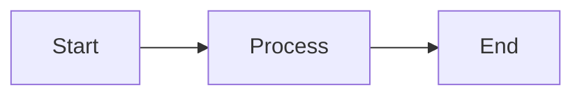

# Documentation Integration Guide

This guide explains how to integrate your raibid-labs repository with the central documentation hub at [raibid-labs.github.io/docs](https://raibid-labs.github.io/docs).

## Overview

The documentation hub automatically aggregates documentation from all raibid-labs repositories that have a `/docs` directory. When you push changes to your repository or publish a release, the documentation site will automatically update.

## Quick Start

### 1. Create Documentation Directory

Create a `/docs` directory in your repository root:

```bash
mkdir -p docs
```

### 2. Add Documentation Files

Add markdown files to your `/docs` directory. Use the following template for your main docs:

```markdown
---
title: Your Project Name
description: Brief description of your project
tags: [relevant, tags, here]
---

# Your Project Name

Your documentation content here...
```

### 3. Set Up Automatic Sync (Optional but Recommended)

To trigger the docs site to update immediately when you push changes, add this GitHub Action to your repository:

Create `.github/workflows/notify-docs-hub.yml`:

```yaml
name: Notify Documentation Hub

on:
  push:
    branches:
      - main
    paths:
      - 'docs/**'

  release:
    types: [published]

jobs:
  notify-docs:
    runs-on: ubuntu-latest
    permissions:
      contents: read

    steps:
      - name: Trigger docs sync
        run: |
          curl -L \
            -X POST \
            -H "Accept: application/vnd.github+json" \
            -H "Authorization: Bearer ${{ secrets.GITHUB_TOKEN }}" \
            -H "X-GitHub-Api-Version: 2022-11-28" \
            https://api.github.com/repos/raibid-labs/docs/dispatches \
            -d '{"event_type":"docs-updated","client_payload":{"repository":"${{ github.repository }}","ref":"${{ github.ref }}","sha":"${{ github.sha }}"}}'
```

## Documentation Structure

### Recommended Directory Layout

```
your-repo/
├── docs/
│   ├── index.md          # Main documentation page (auto-generated if missing)
│   ├── getting-started.md
│   ├── api-reference.md
│   ├── examples.md
│   └── contributing.md
├── src/
└── README.md
```

### Frontmatter

All markdown files should include frontmatter with at least:

```yaml
---
title: Page Title
description: Brief description
tags: [tag1, tag2]
---
```

### Internal Links

Use Obsidian-style wikilinks for internal documentation references:

```markdown
See [[getting-started]] for more information.
See [[api-reference#authentication]] for authentication details.
```

## Versioning

### Using Git Tags

The documentation hub automatically tracks your repository's releases and tags:

1. **Releases**: Create releases on GitHub for versioned documentation
2. **Tags**: Git tags are displayed if no releases exist
3. **Last Updated**: Automatically tracked from your last commit

### Creating a Release

```bash
# Tag your release
git tag -a v1.0.0 -m "Release version 1.0.0"
git push origin v1.0.0

# Create release on GitHub
gh release create v1.0.0 --title "v1.0.0" --notes "Release notes here"
```

The documentation hub will automatically:
- Display the latest release version
- Link to the release page
- Show the release date
- Update the "Last Push" timestamp

## Sync Behavior

### Automatic Syncs

The documentation hub syncs automatically in these scenarios:

1. **Daily Scheduled Sync**: Every day at 02:00 UTC
2. **Push to Docs**: When you push changes to your `/docs` directory (if you added the workflow)
3. **Release Published**: When you publish a new release (if you added the workflow)
4. **Manual Trigger**: Maintainers can manually trigger a sync

### Sync Process

When a sync is triggered:

1. The hub discovers all raibid-labs repositories
2. Filters to public repos with `/docs` directories
3. Updates git submodules to latest commits
4. Collects version information (releases, tags, dates)
5. Regenerates index pages with version info
6. Rebuilds and deploys the Quartz site

## Best Practices

### Documentation Quality

- **Use Clear Titles**: Make page titles descriptive and searchable
- **Add Descriptions**: Include meaningful frontmatter descriptions
- **Tag Appropriately**: Use relevant tags for discoverability
- **Link Between Pages**: Use wikilinks to create a knowledge graph
- **Include Examples**: Provide code examples with syntax highlighting

### Markdown Standards

- Use CommonMark-compliant markdown
- Use ATX-style headings (`#` not underlines)
- Include alt text for images
- Use fenced code blocks with language identifiers

### File Organization

```markdown
# Good structure
- Use descriptive filenames: `api-authentication.md`
- Group related docs in subdirectories: `docs/guides/`
- Keep files focused and under 1000 lines

# Avoid
- Generic names: `page1.md`, `doc.md`
- Very long single files
- Binary files in `/docs` (use images sparingly)
```

## Features

### Graph View

All documentation is connected in a graph view showing relationships between pages. Use wikilinks to create connections.

### Search

Full-text search is automatically enabled. Use descriptive headings and content for better searchability.

### Dark Mode

The documentation site supports light and dark themes.

### Backlinks

Each page automatically shows which other pages link to it.

## Troubleshooting

### My docs aren't showing up

**Check:**
1. Is your repository public?
2. Does it have a `/docs` directory?
3. Are there `.md` files in `/docs`?
4. Is the repo in the ignorelist (`config/ignorelist.json`)?

**Wait time:**
- Manual sync: Immediate
- Automatic sync: Up to 24 hours (daily schedule)
- With workflow: ~2-3 minutes after push

### Version info not displaying

**Ensure:**
1. You have created releases or tags on GitHub
2. The documentation hub workflow has run since your release
3. Your project index has been regenerated

**Force update:**
Ask a maintainer to manually trigger the workflow with `skip_discovery: false`

### Links are broken

**Common issues:**
1. Using markdown-style links instead of wikilinks
2. Incorrect relative paths
3. Referencing files outside `/docs` directory

**Solution:**
Use Obsidian-style wikilinks: `[[filename]]` or `[[filename#heading]]`

## Support

For issues with the documentation hub:
- Open an issue: [raibid-labs/docs/issues](https://github.com/raibid-labs/docs/issues)
- Check workflow runs: [raibid-labs/docs/actions](https://github.com/raibid-labs/docs/actions)

For repository-specific documentation:
- Refer to individual project repositories
- Contact project maintainers

## Advanced Configuration

### Custom Index Pages

If you want a custom index page instead of the auto-generated one, create `docs/index.md` in your repository. The hub will use your custom index if it exists.

### Excluding Files

Files and directories starting with `.` or `_` are automatically ignored by Quartz.

### Adding Diagrams

Quartz supports Mermaid diagrams:



## Migration from Existing Docs

If you have existing documentation elsewhere:

1. Move markdown files to `/docs`
2. Add frontmatter to all files
3. Convert links to wikilink format
4. Update image paths to be relative
5. Test locally with Quartz if possible
6. Push to GitHub and verify after sync

---

**Last Updated**: 2025-11-10

*For more information, see the [main repository](https://github.com/raibid-labs/docs).*
